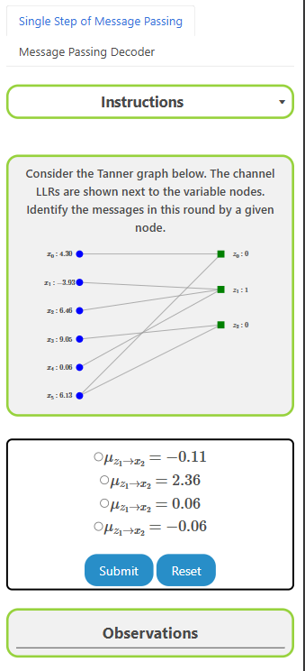
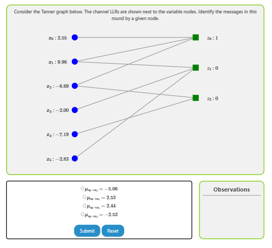
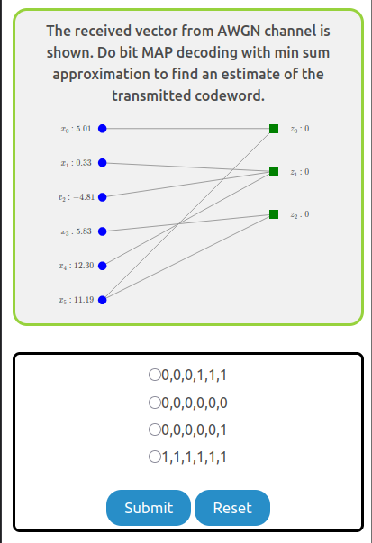

The experiment consists of two tasks. The user is recommended to go through these in the same sequence as they are presented.

1. Single Step of Message Passing
   - Given a Tanner graph, learn how the messages pass and identify the messages by a given node
2. Message Passing Decoder
   - Given a Tanner graph, learn to decode to find an estimate of the transmitted codeword.

### Overview of the Experiment window

    

The experiment window consists of the following components:

1. **Task tab**: The task tab contains the list of tasks that need to be performed in the experiment. The user can navigate to any task by clicking on the corresponding task in the task tab.
2. **Instruction box**: The instruction box displays step-by-step instructions to perform the task.
3. **Question box**: The question box displays the question to be answered by the user.
4. **Observation box**: The observation box displays the feedback messages based on the user's input.
5. **Action box**: The action box contains the input elements and buttons to perform the task.

### Experiment:

There are two tasks in this experiment.

#### Task 1: Single Step of Message Passing

Given a Tanner graph, identify the messages in this round by a given node.

    

#### Task 2: Message Passing Decoder

Given a Tanner graph, you have to perform multiple iterations of message passing between all nodes to estimate the original transmitted codewor

    

