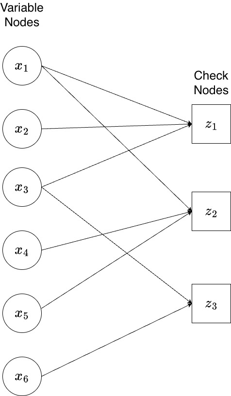

We now describe the general message passing algorithm for achieving Bit-wise Maximum Aposterior Probability (MAP) Decoding of linear codes on general channels. We focus on Additive White Gaussian Noise (AWGN) channels, but the principles can be adapted to other channel models.

### Bit-wise MAP decoding principle for linear codes

Let $\bm{x}=(x_1,\ldots,x_n)\in {\cal C}$ be the codeword transmitted from the linear code $\cal C$ of dimension $k$. Let $\bm{y}=(y_1,\ldots,y_n)$ be the received vector from the channel. The bit-wise MAP estimate of the bit $x_i$ is based on the value of the log-likelihood ratio (LLR) of $x_i$ given $\bm{y}$, denoted by $L(x_i|\bm{y})$, and defined as follows.

$$L(x_i)\triangleq \log\left(\frac{p(x_i=0|\bm{y})}{p(x_i=1|\bm{y})}\right).$$

In the case of AWGN channels, we assume without loss of generality that $x_i\in\{+1,-1\}$, under a bipolar signalling scheme. Thus, the LLR $L(x_i)$ is then defined as
$$L(x_i)\triangleq \log\left(\frac{p(x_i=+1|\bm{y})}{p(x_i=-1|\bm{y})}\right).$$

The bitwise MAP estimate for $x_i$ is then denoted by $\hat{x}_i$ and calculated as follows.

$$
\begin{align}
\hat{x}_i=\begin{cases}0,& \text{if}~L(x_i)>0\\
1, & \text{if}~L(x_i)<0.
\end{cases}
\end{align}
$$

Note that we assume ties are broken arbitrarily, i.e., the decoder choose the estimate $\hat{x}_i$ randomly if $L(x_i|\bm{y})=0$.

As before, we assume that the Tanner graph of the code $\cal C$ is cycle-free, i.e., the Tanner graph has no sequence of edges between adjacent vertices which start and end at the same vertex. Thus, the Tanner graph is a tree. With this assumption in mind, the belief propagation approach is described on the Tanner graph of the code, which leads to an efficient computation of the Bit-wise MAP of each bit in the codeword transmitted.

#### Message Passing for LDPC Codes on AWGN Channels

The Min-Sum algorithm is an iterative procedure where messages, representing LLRs, are passed between variable nodes and check nodes on the Tanner graph.

#### The Min-Sum Decoding Algorithm

The algorithm consists of initialization followed by a series of iterations until a termination condition is met.

**Step 1: Initialization**

1.  **Channel LLRs:** For each received value $y_i$ from the AWGN channel with noise variance $\sigma^2 = N_0/2$ and assuming BPSK modulation ($0 \mapsto +1, 1 \mapsto -1$), the initial channel LLR is calculated as:
    $$L_{ch}(x_i) = \frac{2y_i}{\sigma^2}$$
    This value represents the initial belief about bit $x_i$ from the channel observation alone.
2.  **Message Initialization:** Messages from check nodes to variable nodes are set to zero before the first iteration. Let $L_{j \to i}^{(k)}$ be the message from check node $z_j$ to variable node $x_i$ in iteration $k$. Then, $L_{j \to i}^{(0)} = 0$ for all edges $(x_i, z_j)$.

**Step 2: Iterative Processing (for iteration $k=1, 2, \dots, k_{max}$)**

**A. Variable Node (VN) to Check Node (CN) Update:**
Each variable node $x_i$ sends a message $L_{i \to j}^{(k)}$ to each adjacent check node $z_j$. This message is the sum of the channel LLR and all incoming messages from other check nodes in the previous iteration.
$$L_{i \to j}^{(k)} = L_{ch}(x_i) + \sum_{j' \in N(x_i) \setminus \{j\}} L_{j' \to i}^{(k-1)}$$
where $N(x_i)$ is the set of check nodes connected to $x_i$.

**B. Check Node (CN) to Variable Node (VN) Update:**
Each check node $z_j$ sends a message $L_{j \to i}^{(k)}$ to each adjacent variable node $x_i$. The Min-Sum approximation provides a simplified rule for this update:
$$L_{j \to i}^{(k)} = \left(\prod_{i' \in N(z_j) \setminus \{i\}} \operatorname{sgn}\left(L_{i' \to j}^{(k)}\right)\right) \times \min_{i' \in N(z_j) \setminus \{i\}} \left|L_{i' \to j}^{(k)}\right|$$
where $N(z_j)$ is the set of variable nodes connected to $z_j$. The message's sign is determined by the product of the signs of incoming messages (to satisfy the parity check), and its magnitude is the minimum of the incoming magnitudes.

**Step 3: LLR Aggregation and Decision**
After the check node update, each variable node aggregates all its information to compute a total LLR and make a hard decision.

1.  **Total LLR:** $L_{total}^{(k)}(x_i) = L_{ch}(x_i) + \sum_{j \in N(x_i)} L_{j \to i}^{(k)}$.
2.  **Hard Decision:** A temporary decoded vector $\hat{\bm{x}}^{(k)}$ is formed using the rule: $\hat{x}_i = 0$ if $L_{total}^{(k)}(x_i) \ge 0$, and $\hat{x}_i = 1$ otherwise.

**Step 4: Termination**
The iterations stop if either of these conditions is met:

1.  **Valid Codeword:** The hard decision vector $\hat{\bm{x}}^{(k)}$ satisfies all parity checks (i.e., $H(\hat{\bm{x}}^{(k)})^T = \bm{0}$). The algorithm terminates successfully.
2.  **Maximum Iterations:** The algorithm reaches a predefined maximum number of iterations, $k_{max}$. If the result is not a valid codeword, a decoding failure is declared.

#### A Worked Example of Min-Sum Decoding

Let's illustrate the algorithm with a concrete example.

**Scenario Setup**

- **Code:** A rate-1/2, length-6 LDPC code defined by the parity-check matrix:

  $$
  H = \begin{pmatrix}
  1 & 1 & 1 & 0 & 0 & 0 \\
  1 & 0 & 0 & 1 & 1 & 0 \\
  0 & 0 & 1 & 0 & 0 & 1
  \end{pmatrix}
  $$

  The Tanner graph for this code is cycle-free (a tree).
  

    
  

- **Transmission:**
  - Transmitted codeword: $\bm{x} = (0, 0, 0, 0, 0, 0)$.
  - Modulation: BPSK ($0 \mapsto +1$). Transmitted signal: $\bm{s} = (+1, +1, +1, +1, +1, +1)$.
  - Channel: AWGN with noise variance $\sigma^2 = 0.5$.
  - Received vector (with errors in the first two positions): $\bm{y} = (-0.5, -0.2, 1.1, 0.8, 1.5, 0.4)$.

**Step 1: Initialization**
We calculate the channel LLRs using $L_{ch}(x_i) = 2y_i / \sigma^2 = 4y_i$.

| Bit ($i$) | $y_i$ | $L_{ch}(x_i)$ |
| :-------: | :---: | :-----------: |
|     0     | -0.5  |     -2.0      |
|     1     | -0.2  |     -0.8      |
|     2     |  1.1  |     +4.4      |
|     3     |  0.8  |     +3.2      |
|     4     |  1.5  |     +6.0      |
|     5     |  0.4  |     +1.6      |

---

#### Iteration 1

**A. Variable Node → Check Node Update**
Since all $L_{j \to i}^{(0)} = 0$, the first VN-to-CN messages are simply the channel LLRs: $L_{i \to j}^{(1)} = L_{ch}(x_i)$.

- $L_{0 \to 0}^{(1)} = -2.0$; $L_{0 \to 1}^{(1)} = -2.0$
- $L_{1 \to 0}^{(1)} = -0.8$
- $L_{2 \to 0}^{(1)} = +4.4$; $L_{2 \to 2}^{(1)} = +4.4$
- $L_{3 \to 1}^{(1)} = +3.2$
- $L_{4 \to 1}^{(1)} = +6.0$
- $L_{5 \to 2}^{(1)} = +1.6$

**B. Check Node → Variable Node Update**
The check nodes compute their outgoing messages using the Min-Sum rule.

- **From $z_0$ (to $x_0, x_1, x_2$):**
  - $L_{0 \to 0}^{(1)} = \operatorname{sgn}(-0.8)\operatorname{sgn}(+4.4) \times \min(|-0.8|, |+4.4|) = -0.8$
  - $L_{0 \to 1}^{(1)} = \operatorname{sgn}(-2.0)\operatorname{sgn}(+4.4) \times \min(|-2.0|, |+4.4|) = -2.0$
  - $L_{0 \to 2}^{(1)} = \operatorname{sgn}(-2.0)\operatorname{sgn}(-0.8) \times \min(|-2.0|, |-0.8|) = +0.8$
- **From $z_1$ (to $x_0, x_3, x_4$):**
  - $L_{1 \to 0}^{(1)} = \operatorname{sgn}(+3.2)\operatorname{sgn}(+6.0) \times \min(|+3.2|, |+6.0|) = +3.2$
  - $L_{1 \to 3}^{(1)} = \operatorname{sgn}(-2.0)\operatorname{sgn}(+6.0) \times \min(|-2.0|, |+6.0|) = -2.0$
  - $L_{1 \to 4}^{(1)} = \operatorname{sgn}(-2.0)\operatorname{sgn}(+3.2) \times \min(|-2.0|, |+3.2|) = -2.0$
- **From $z_2$ (to $x_2, x_5$):**
  - $L_{2 \to 2}^{(1)} = \operatorname{sgn}(+1.6) \times |+1.6| = +1.6$
  - $L_{2 \to 5}^{(1)} = \operatorname{sgn}(+4.4) \times |+4.4| = +4.4$

**C. LLR Update and Decision (End of Round 1)**
We sum the channel LLR and incoming messages for each bit.

| Bit ($i$) | $L_{ch}(x_i)$ |                    Incoming Messages Sum                    | $L_{total}^{(1)}(x_i)$ | $\hat{x}_i^{(1)}$ |
| :-------: | :-----------: | :---------------------------------------------------------: | :--------------------: | :---------------: |
|     0     |     -2.0      | $L_{0 \to 0}^{(1)} + L_{1 \to 0}^{(1)} = -0.8 + 3.2 = +2.4$ |        **+0.4**        |         0         |
|     1     |     -0.8      |                 $L_{0 \to 1}^{(1)} = -2.0$                  |        **-2.8**        |         1         |
|     2     |     +4.4      | $L_{0 \to 2}^{(1)} + L_{2 \to 2}^{(1)} = +0.8 + 1.6 = +2.4$ |        **+6.8**        |         0         |
|     3     |     +3.2      |                 $L_{1 \to 3}^{(1)} = -2.0$                  |        **+1.2**        |         0         |
|     4     |     +6.0      |                 $L_{1 \to 4}^{(1)} = -2.0$                  |        **+4.0**        |         0         |
|     5     |     +1.6      |                 $L_{2 \to 5}^{(1)} = +4.4$                  |        **+6.0**        |         0         |

**Analysis:** After one iteration, the LLR for bit $x_0$ has flipped sign from negative to positive, correcting the first error. The temporary codeword is $\hat{\bm{x}}^{(1)} = (0, 1, 0, 0, 0, 0)$. This is not a valid codeword, so we proceed.

---

#### Iteration 2

**A. Variable Node → Check Node Update**
We use the messages $L_{j \to i}^{(1)}$ from the previous step.

- $L_{0 \to 0}^{(2)} = L_{ch}(x_0) + L_{1 \to 0}^{(1)} = -2.0 + 3.2 = +1.2$
- $L_{0 \to 1}^{(2)} = L_{ch}(x_0) + L_{0 \to 0}^{(1)} = -2.0 - 0.8 = -2.8$
- $L_{1 \to 0}^{(2)} = L_{ch}(x_1) = -0.8$
- $L_{2 \to 0}^{(2)} = L_{ch}(x_2) + L_{2 \to 2}^{(1)} = +4.4 + 1.6 = +6.0$
- $L_{2 \to 2}^{(2)} = L_{ch}(x_2) + L_{0 \to 2}^{(1)} = +4.4 + 0.8 = +5.2$
- $L_{3 \to 1}^{(2)} = L_{ch}(x_3) = +3.2$
- $L_{4 \to 1}^{(2)} = L_{ch}(x_4) = +6.0$
- $L_{5 \to 2}^{(2)} = L_{ch}(x_5) = +1.6$

**B. Check Node → Variable Node Update**

- **From $z_0$:**
  - $L_{0 \to 0}^{(2)} = \operatorname{sgn}(-0.8)\operatorname{sgn}(+6.0) \times \min(|-0.8|, |+6.0|) = -0.8$
  - $L_{0 \to 1}^{(2)} = \operatorname{sgn}(+1.2)\operatorname{sgn}(+6.0) \times \min(|+1.2|, |+6.0|) = +1.2$
  - $L_{0 \to 2}^{(2)} = \operatorname{sgn}(+1.2)\operatorname{sgn}(-0.8) \times \min(|+1.2|, |-0.8|) = -0.8$
- **From $z_1$:**
  - $L_{1 \to 0}^{(2)} = \operatorname{sgn}(+3.2)\operatorname{sgn}(+6.0) \times \min(|+3.2|, |+6.0|) = +3.2$
  - $L_{1 \to 3}^{(2)} = \operatorname{sgn}(-2.8)\operatorname{sgn}(+6.0) \times \min(|-2.8|, |+6.0|) = -2.8$
  - $L_{1 \to 4}^{(2)} = \operatorname{sgn}(-2.8)\operatorname{sgn}(+3.2) \times \min(|-2.8|, |+3.2|) = -2.8$
- **From $z_2$:**
  - $L_{2 \to 2}^{(2)} = +1.6$
  - $L_{2 \to 5}^{(2)} = +5.2$

**C. LLR Update and Decision (End of Round 2)**

| Bit ($i$) | $L_{ch}(x_i)$ |                    Incoming Messages Sum                    | $L_{total}^{(2)}(x_i)$ | $\hat{x}_i^{(2)}$ |
| :-------: | :-----------: | :---------------------------------------------------------: | :--------------------: | :---------------: |
|     0     |     -2.0      | $L_{0 \to 0}^{(2)} + L_{1 \to 0}^{(2)} = -0.8 + 3.2 = +2.4$ |        **+0.4**        |       **0**       |
|     1     |     -0.8      |                 $L_{0 \to 1}^{(2)} = +1.2$                  |        **+0.4**        |       **0**       |
|     2     |     +4.4      | $L_{0 \to 2}^{(2)} + L_{2 \to 2}^{(2)} = -0.8 + 1.6 = +0.8$ |        **+5.2**        |         0         |
|     3     |     +3.2      |                 $L_{1 \to 3}^{(2)} = -2.8$                  |        **+0.4**        |         0         |
|     4     |     +6.0      |                 $L_{1 \to 4}^{(2)} = -2.8$                  |        **+3.2**        |         0         |
|     5     |     +1.6      |                 $L_{2 \to 5}^{(2)} = +5.2$                  |        **+6.8**        |         0         |

**Conclusion:** After the second iteration, the LLR for bit $x_1$ has also flipped to positive. The hard decision vector is now $\hat{\bm{x}}^{(2)} = (0, 0, 0, 0, 0, 0)$. We check this against the parity-check matrix: $H(\hat{\bm{x}}^{(2)})^T = \bm{0}$. The codeword is valid, and the algorithm terminates successfully with the correct decoded codeword.
